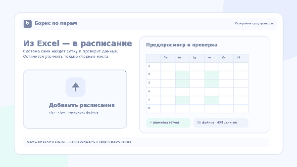

# Визуальная идентичность «Борис по парам»

Версия 2.18 добавила полноценную фирменную систему вместо текстовой буквы «П» и пустых служебных экранов. Начиная с версии 2.24 продукт называется **«Борис по парам»**; технические идентификаторы установки `planner-solving` сохранены для обратной совместимости.

С версии **2.26** все критические изображения интерфейса поставляются в PNG. Причина — предсказуемая декодируемость в старых браузерах и встроенных WebView: WebP больше не является обязательной частью пользовательского интерфейса.



## Принцип

Изображения должны помогать оператору понимать назначение продукта, но не занимать рабочее пространство редактора Excel. Поэтому визуальная система применяется в четырёх местах:

1. иконка вкладки браузера и установленного веб-приложения;
2. компактный знак в верхней панели;
3. вводная иллюстрация перед загрузкой файлов;
4. иллюстрация завершённого или диагностического результата.

Полноэкранный редактор, таблицы, панель проблем и формы остаются максимально функциональными и не перекрываются изображениями.

## Локальные файлы

Все материалы поставляются вместе с приложением:

```text
web/frontend/
├── favicon.ico
├── favicon.svg
├── site.webmanifest
└── assets/
    └── brand/
        ├── app-icon-128.png
        ├── hero-schedule.png
        └── organized-flow.png
```

Ни один экран не обращается к CDN, внешнему фотохостингу или онлайн-сервису изображений. Визуальная система работает полностью офлайн в автономной установке Astra Linux.

PNG выбран как базовый формат не ради качества сжатия, а ради совместимости. Для UI-иллюстраций используется ограниченная палитра, поэтому файлы остаются компактными. В CI проверяется не только сигнатура файла: валидируются PNG chunks, CRC и фактическая распаковка `IDAT`, чтобы обрезанный или повреждённый файл не мог пройти сборку.

## Иконка

Иконка объединяет:

- календарную сетку;
- цветные блоки занятий;
- линию последовательного восстановления;
- узлы проверки;
- знак автоматического решения.

`favicon.svg` используется современными браузерами. `favicon.ico` оставлен для старых браузеров и автоматического запроса `/favicon.ico`. PNG-иконка используется Web App Manifest и встроенными браузерами, которым нужен растровый формат.

## Цвета

Основная палитра:

```text
Синий          #315EFB
Глубокий синий #2347D7
Индиго         #5848E9
Бирюзовый      #14C8B8
Голубой        #4BCFF0
Фиолетовый     #8065EF
Основной текст #111A34
```

Синий обозначает основное действие, бирюзовый — успешно восстановленные данные, фиолетовый — интеллектуальную обработку и связи между частями расписания.

## Интерфейс и иерархия действий

В 2.26 визуальная система дополнена явными правилами пользовательского флоу:

- на каждом этапе есть **один** основной следующий шаг;
- прогресс загрузки ограничен шириной своей области и не может выходить за карточку;
- на этапе проверки единственное основное действие — «Сформировать»;
- на экране результата навигация «← К исправлениям» вынесена отдельно от действий с готовыми файлами;
- «Скачать расписание» — главное действие результата;
- недельный файл — вторичное действие;
- история и новый сеанс — третичные служебные действия и визуально не конкурируют со скачиванием.

`brand-refresh.js` выполняется до `Vue.mount()`, а затем идемпотентно восстанавливает брендирование и иерархию на фактически смонтированном DOM. Наблюдатель нужен только для экранов, которые Vue создаёт позже при смене этапа.

`brand-refresh.css`, `interface-clean.css` и `ux-flow-2-26.css` отвечают за:

- фирменный фон;
- стеклянную верхнюю панель;
- вводный экран;
- адаптивную композицию изображений;
- карточки и основные кнопки;
- сдержанную иерархию действий результата;
- режим уменьшенного движения.

## Доступность

Содержательные изображения имеют русское описание `alt`. Повторяющаяся иконка в шапке помечена как декоративная. Навигационное действие результата имеет отдельную доступную подпись. При `prefers-reduced-motion: reduce` декоративные эффекты уменьшаются.

## Проверка

Автоматические тесты проверяют:

- наличие SVG и ICO favicon;
- корректность Web App Manifest;
- наличие и фактическую декодируемость локальных PNG-иллюстраций;
- CRC каждого PNG chunk и распаковку растра;
- отсутствие внешних URL в бренд-модуле;
- подключение брендирования до запуска Vue;
- ограничение ширины прогресса загрузки;
- отсутствие второго конкурирующего основного действия на этапе проверки;
- отдельную навигацию и иерархию действий на экране результата;
- адаптивные правила и режим уменьшенного движения.
